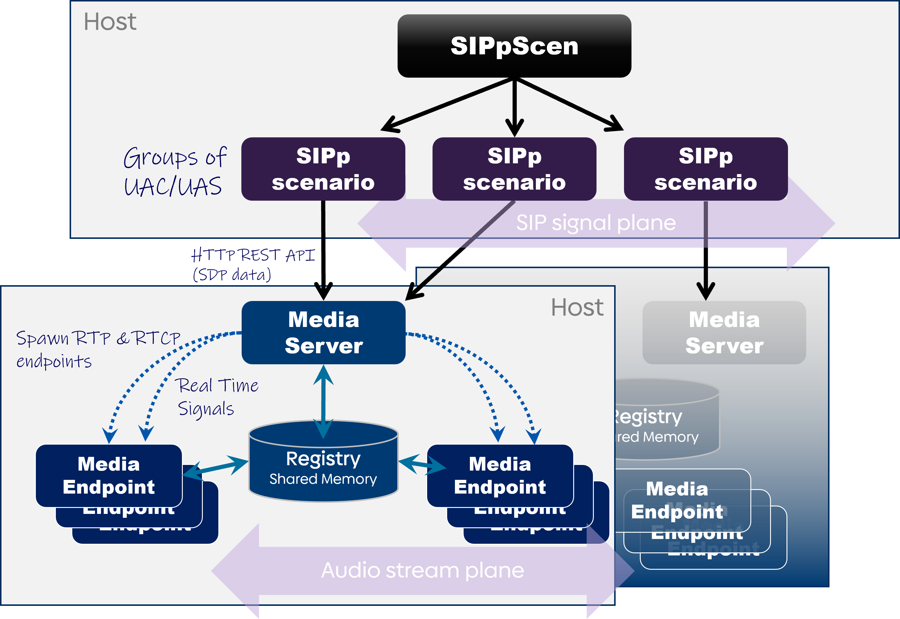

# SIPpScen
SIP traffic generation scenarios, with audio stream support (RTP & RTCP)

## Architecture



**SIPpScen**: The main orchestrator of the scenarios. The scenarios are configured in YAML configuration files.   

**SIPp scenario**: These are [SIPp](https://sipp.readthedocs.io/en/latest/) instances, spawned by SIPpScen. Each SIPp instance facilitates a group of UAC or a group of UAS, according to the configured overall scenario. Their communication constitudes the SIP signal plane. SIPp instances run on the same host as SIPpScen.  

**Media Server**: Media server exposes an HTTP API, through which SIPp instances can send requests to a Media Server to spawn RTP and RTCP endpoints, based on the exchanged SDP messages. More than one Media Servers can be instantiated, distributed on separate hosts.  

**Media Endpoints**:  The RTP and RTCP endpoints.  These are responsible for establishing the audio stream communication plane. Media endpoints are separate processes (based on [PJSIP](https://github.com/pjsip/pjproject) project) which run on the same host as the Media Server.  

**Registry**: This is a shared memory segment - one per Memory Server - which keeps track of the already active Media endpoints. This mechanism allows already spawned Media Endpoint processes to be reused, when they no longer serve any UAC or UAS.  


## Build instructions

- Install `libpistache-dev`
- Download and build pjsip
 -- Download or clone latest release of `PJSIP` project (https://github.com/pjsip/pjproject)
 -- Copy `custom_configure.sh` in pjproject directory:
 ``` cp custom_configure.sh pjproject ```
 -- Configure, build and install the project:
 ```
 cd pjproject
 ./custom_configure.sh
 make dep
 make
 make install
 ```
  
  - Change to `media-project` directory and build the project:
  ```  make   ```


## Installation and Configuration
On a Debian / Ubuntu machine, install the package: 
```
sudo dpkg -i sippscen_*.deb
```
Suppose that a Media Server will be running on port :9090. Set it up as follows:
```
sudo systemctl enable --now media-server@9090.service
```
Media Server's configuration is defined in `/etc/media-server/server.conf`. The following settings can be configured:
- PORT: override the listening port (e.g. other than port 9090)
-  WAVE: the full path of wavefile, that UAC will be transmitting. If the call duration is greater than the wavefile's duration, it will be looping until the end of the call's duration. 
- CODEC: currently, audio encoded in ITU G.711 codec is supported. It can be either a-law or μ-law. Set the used codec to either *pcma* or *pcmu*, respectively
- URL, token, org, bucket: influxDB connection details. If provided, endpoint will calculate MOS scores, based on RTCP receipts, and then send them over to an influxDB database. 

More than one Media Servers can be running on the same host. E.g. on port :9080:
```
sudo systemctl enable --now media-server@9080.service
```
If these should differ in their settings, set their unique configuration inside a file named `/etc/media-server/server-<PORT>.conf`, where \<PORT\> is the server's port (e.g. 9080).  

Now that the Media Server(s) are up and running, create a working directory for running SIPpScen, e.g.:
```
mkdir ~/sippscen
cd ~/sippscen
```
and copy in there the provided configuration files and scenarios, as references to get started:
```
cp -r /etc/media-server/SIPpScen/scenarios/ /etc/media-server/SIPpScen/*.yaml .
```

## Scenario run
sippscen command is quite straightforward in its invoking:
```
sippscen -h
usage: sippscen.py [-h] [-d] -c CONFIG

 SIPp scenarios orchestrator


options:
  -h, --help            show this help message and exit
  -d, --dry-run         Run in dry run mode
  -c CONFIG, --config CONFIG
                        Configuration YAML file
  -D                    Run as a daemon (output: sippscen.log)
```
The simplest test run is to set up a UAC and a UAS locally, e.g. :
```
sippscen -c local_test.yaml
```
This will validate the YAML scenario configuration, then generate all necessary SIPp files, inside *run_conf* directory, and finally spawn the required SIPp instances. 

### Scenario configuration
Each YAML scenario configuration file consists of the following senctions, as they will be explained below.

- **influxdb**

If this section is configured, SIPpScen will also start up a *telegraf* agent, during the runs, to deliver run statistics to an influxDB database.

 - **rtp-servers**  
 
 A list of Media Servers to be assigned to the SIPp instances.   
 E.g. the following setting names Media Server listening on 10.10.10.10:9090 as *ms1*, which can be referenced by the SIPp instances in *scenario* section. 
 ```
 rtp-servers:
  - ms1: 10.10.10.10:9090
```

- **run**

The run duration, as well as global time tolerances for the arrival of a SIP response and the delivery of a SIP request. E.g.: 
```
run:
  duration: 1h30m
  receive-timeout: 5s
  send-timeout: 5s
```
- **scenario**

This is the list of SIPp descriptions, which are to be spawned. These can be either User Agent Clients (i.e. callers, ref. `type: client`) or User Agent Servers (i.e. callees, ref. `type: server`).  Servers will start up first, followed by the Clients. They will terminate in the reverse order, at the end of the run.   
Let's look at a scenario example, and then explain its definition fields. 
```
scenario:
  - B-callers:
      type: server
      scenario-file: uas_template
      number-endpoints: 1
      cps: 2
      call-duration: 10s500ms
      rtp-server: ms1
      rtp-port-offset: 21000
      sip-port: 5061
      dn-start: 30210117000
      local-ip: 127.0.0.1
      # receive-timeout: 5s
      # send-timeout: 50ms
      register:
       registrar: 127.0.0.1:5666
       register-file: register_template
       unregister-file: unregister_template
       cps: 10

  - A-callers:
      type: client
      scenario-file: uac_LbR_template
      #number-endpoints: 160
      cps: 2.5
      call-duration: 10s
      #total-calls: 1
      rtp-server: ms1
      rtp-port-offset: 20050
      sip-port: 5060
      dn-start: 30220117000
      local-ip: 127.0.0.1
      destination: 127.0.0.1:5061
      call-service: 911556
      #pattern:
      #  timepoints:
      #    - 10s
      #    - 20s
      #  cps:
      #    - 2
      #    - 1
      #  repeat: true
```

- **B-callers:**  A name given to the group of these SIP User Agents.
- **type:** `server` (for UAS) or `client` (for UAC)
- **scenario-file:** the template file to be used. template files should reside in a `scenarios` directory
- **number-endpoints:** limit the number of spawned Media Endpoints. If it is not provided, their number is computed from `cps * call-duration`
- **cps:** the targeted generated "calls-per-second" traffic
- **call-duration:** the duration of each call session
- **total-calls:** applicable to UAC groups, if set, the number of generated calls will be limited to this number 
- **rtp-server:** the Media Server to use, as defined in *rtp-servers:* section
- **rtp-port-offset:** the starting port of the range of UDP ports to be used by the Media Endpoints, for RTP and RTCP channels. For example, if set to *21000*, the 1st Endpoint will use :21000 for RTP and :21001 for RTCP, the 2nd Endpoint will use :21002 for RTP and :21003 for RTCP, and so forth.
- **sip-port:** the SIP port that the group of UA will use
- **dn-start:** the starting number of the range of contact numbers to be used by the group of UA
- **local-ip:** the IP address to use. If not specified, it will use the assigned IP address of the host's primary network interface
- **receive-timeout:** override value of the global respective value
- **send-timeout:** override value of the global respective value

If a **register:** section is provided, the UA will register themselves, to the provided Registrar, at the beginning of the run, and finally unregister themselves, at the end of the run.  The register input are as follows:
- **registrar:** the Registrar's listening socket
- **register-file:** the template file for the REGISTER requests; it should be inside `scenarios` directory
- **unregister-file:** the template file for the unREGISTER requests; it should be inside `scenarios` directory
- **cps:** the rate of sending the REGISTER and unREGISTER requests to the Registrar

Additionally, a pattern of generated traffic can be defined, throught the **define:** section. Obviously, this is valid only for the UAC groups (i.e. callers). For example, this pattern has the following meaning:
```
      pattern:
        timepoints:
          - 10s
          - 20s
        cps:
          - 3
          - 1
        repeat: true
 ```
 
 **timepoints:** is a list of points in time - with reference to the start of the run - at which the respective traffic rate of the **cps:** list will be applied. This pattern of cps changes can be executed once, or repeatable, through the **repeat:** option.   
 For example, the above pattern is translated as follows:  
 10 seconds after the start of the run, change traffic to 3 cps; after 20 sec. pass, change traffic to 1 cps; and after 10 sec. pass, change traffic to 3 cps, and so forth.  
 

## Ship logs to ElasticSearch

SIP traces and errors are logged inside `log` directory. In `etc/media-server/SIPpScen/elk-files/` directory, templates for filebeat and logstash configurations are provided, so that these traces and errors can be shipped, parsed and stored to an ElasticSearch database.  


